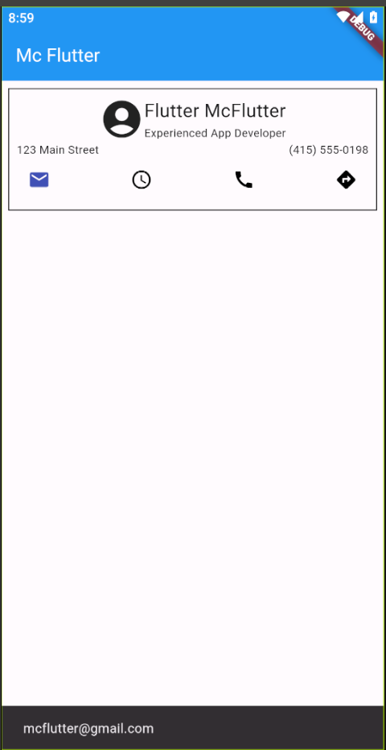

# Mc Flutter App

- Creación de widgets y estructura básica de la aplicación.
- Uso de `Scaffold`.
- Uso de widgets como `Row`, `Column`, e `IconButton`.
- Integración de íconos y texto en la interfaz de usuario.
- Uso de `StatefulWidget` para gestionar el estado de la botones.
- Mostrar mensajes con `SnackBar` en respuesta a acciones.

## Lo que más me costo trabajo

- **Centrar Widgets:**

  - Encontrar la mejor manera de centrar widgets en la interfaz.

- **Manejo de SnackBars:**

  - Integrar correctamente el manejo de `SnackBar`.

- **StatefulWidget:**
  - Hacer uso correcto de los `StatefulWidget` para hacer cambiar de color los botones.

## Lo que aprendí

- **Estilos en Flutter:**

  - Cómo personalizar y aplicar estilos a la interfaz de usuario.

- **Manejo de Estado:**

  - Entender la diferencia entre `StatelessWidget` y `StatefulWidget`.
  - Cómo gestionar y actualizar el estado de un widget.

- **Funciones**
  - Crear funciones que reciban argumentos y devuelva un widget para tener un código más estructurado.

## Screenshots

## Link video

https://youtu.be/9xZKlSpdcWg

## Referencias

Flutter. ToggleButtons class. API Flutter Dev. Disponible en: https://api.flutter.dev/flutter/material/ToggleButtons-class.html [Accedido: 26 Ene 2022].
Dmitry Zhifarsky. avoid-returning-widgets. DCM. Disponible en: https://dcm.dev/docs/rules/flutter/avoid-returning-widgets/ [Accedido: 26 Ene 2022].
