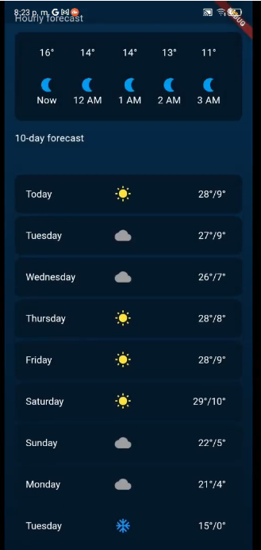

# Weather App

- Creación de widgets y estructura básica de la aplicación.
- Uso de `Scaffold`.
- Uso de widgets como `ListView`, `ListTile`
- Integración de íconos y texto.
- Mostrar mensajes con `SnackBar`.
- Estilos a un container como bordes redondeados y degradados.

## Lo que más me costo trabajo

- **Clase List View:**

  - Encontrar la manera en que se utiliza esta clase ya que era requerido un expanded para utilizarla y no lo recordaba.

- **Clase ListTile**

  - Entender los atributos de esta clase para agregar otros widgets dentro de esta.

- **Alinear elementos en ListTile**

  - Acomodar los elementos para que estuvieran todos a la misma altura y no se moviera el icono dpendiendo de la longitud del texto.

## Lo que aprendí

- **Gradientes:**

  - Aprendi como usar la clase LinearGradient para hacer un degradado en el fondo de mi aplicación.

- **Estilos en texto:**

  - Aplicar los estilos de un texto al tema de la aplicación para que se apliquen en todos y no solo a uno en particular.

- **ListTile y ListView**
  - Aprendi a utilizar estas clases, los atributos que pueden utilizarse.
  - Mostrar SnackBars con la función onTap(){}

## Screenshots

## Link video

https://youtu.be/ZeN2iEbiz3Q

## Referencias

Flutter. ListTile class. API Flutter Dev. Disponible en: https://api.flutter.dev/flutter/material/ListTile-class.html [Accedido: 3 Feb 2022].

Flutter. LinearGradient class. API Flutter Dev. Disponible en: https://api.flutter.dev/flutter/painting/LinearGradient-class.html [Accedido: 3 Feb 2022].

CopsOnRoad. How to change the entire theme's text color in Flutter?. StackOverFlow. Disponible en: https://stackoverflow.com/a/57239060 [Accedido: 3 Feb 2022].
