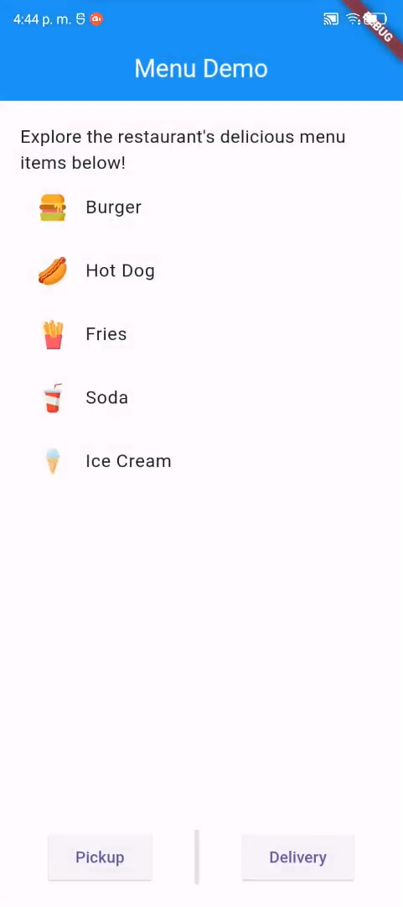
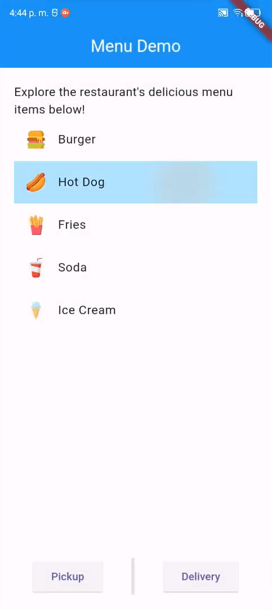
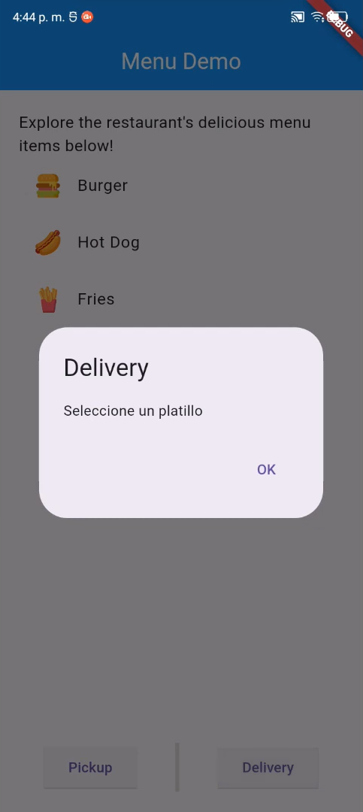
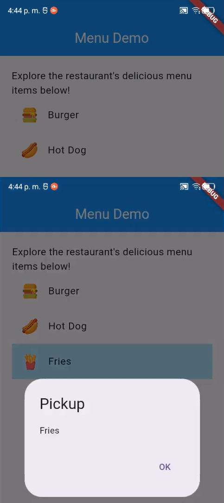

# Menu Demo

- Creación de widgets y estructura básica de la aplicación.
- Uso de `Scaffold`.
- Modularización
- Paso de parámetros.
- Uso de widgets como `ListView`, `ListTile`
- Integración de imágenes con assets.
- Insertar imágenes con Image.asset
- Mostrar cuadros de dialogo con `AlertDialog`.

## Lo que más me costo trabajo

- **Rutas de assets**

  - Me costó encontrar una manera para crear las rutas de assets para que cuadrara con mi list que tenía hecha con los nombres de los productos.

- **List View dentro de una columna**

  - Me costó un poco de trabajo implementar el list view dentro de la columna que era la estructura principal de mi aplicación, luego descubrí que se podia al envolverlo con un Expanded.

- **Actualizar estado de la apliación**

  - Entender cómo actualizar el estado de la aplicación de manera eficiente con el widget ListTile.

## Lo que aprendí

- **AlertDialog Class**

  - Aprendí a como implementar un cuadro de dialogo presionando un botón y a implementar acciones en el mismo.

- **Implementar imágenes**

  - Aprendí a implementar imágenes en mi aplicación con assets y Image.asset

- **Modularización**

  - Modularizar mi aplicación para que no este el código en solo un archivo en el main.

## Screenshots

## Link video

https://youtu.be/6c0Ld_cBa98

## Referencias

Crazy Lazy Cat. Vertical Divider not showing. StackOverFlow. Disponible en: https://stackoverflow.com/a/59960479 [Accedido: 15 Feb 2024].

Flutter. AlertDialog class. API Flutter Dev. Disponible en: https://api.flutter.dev/flutter/material/AlertDialog-class.html [Accedido: 15 Feb 2024].

Flutter. Image.asset constructor. API Flutter Dev. Disponible en: https://api.flutter.dev/flutter/widgets/Image/Image.asset.html [Accedido: 15 Feb 2024].
