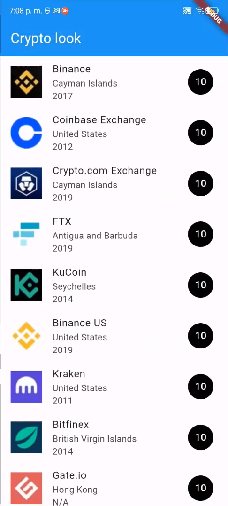

# Crypto Look

- Modularización
- Navegación entre páginas
- Paso de parámetros
- Uso de widgets como `ListView`, `ListTile`
- Cargar datos de un JSON / Mapa

## Lo que más me costo trabajo

- Para esta app no encontré dificultades ya que la mayor parte fue trabajada durante clase y mayormente repase todo lo que hemos visto en clase.

## Lo que aprendí

- **Paso de parámetros**

  - Aprendí como pasar datos entre distintas páginas para poder mostrarlos en sus respectivas pantallas.

- **Cargar datos de JSON**

  - Aprendí a como serializar un string en formato JSON para convertirlo en un objeto que sea reconocido por Dart como tipo de dato válido.

- **Navegación entre páginas**

  - Aprendí como navegar entre páginas usando Navigator push para poder lograrlo.

## Screenshots

## Link video

https://youtu.be/EjocgeH7g6Q
