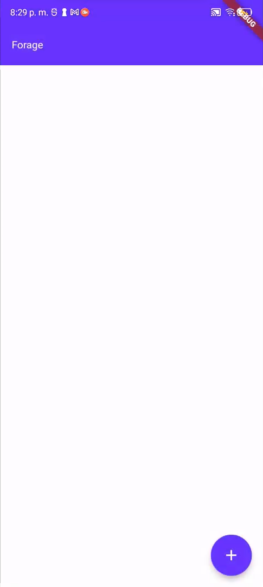
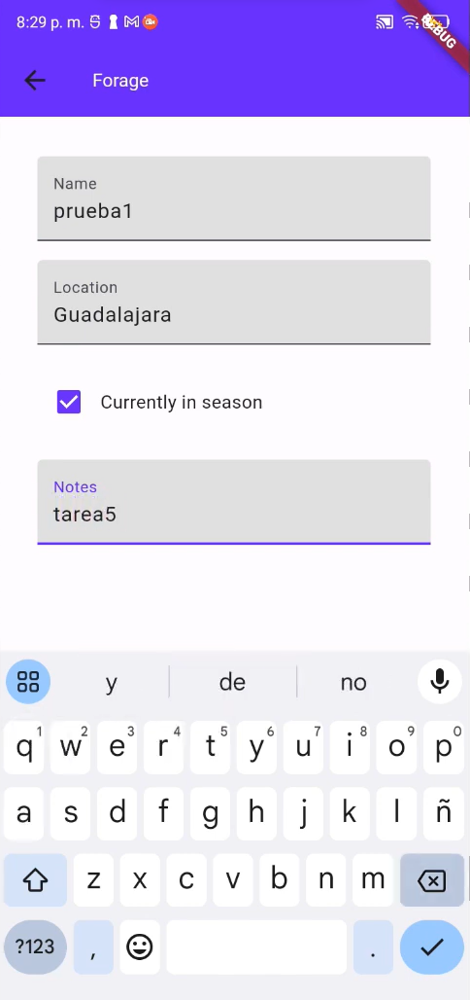
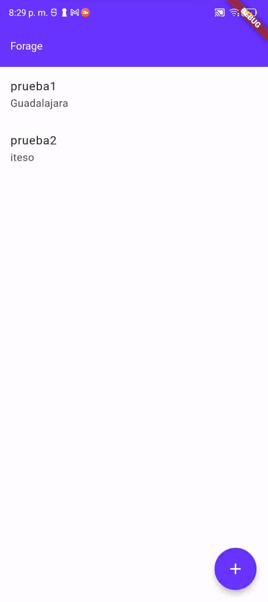
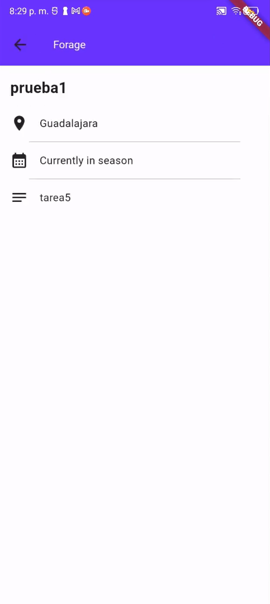

# Forage App

- Creación de widgets y estructura básica de la aplicación.
- Uso de `Scaffold`.
- Modularización
- Uso de widgets como `ListView`, `ListTile` para lista de datos dinámica.
- Utilización de Provider para el manejo de estados y datos compartidos.
- Navegación entre páginas.

## Lo que más me costo trabajo

- **Reemplazar paso de paramétros**

  - Me costo un poco pensar en la lógica de pasar los datos del item de la home page a la details page, ya que lo habiamos estado trabajando con paso de parámetros asi que tuve que pensar una manera de hacerlo con provider.

- **Lista de elementos**

  - Una pregunta con la que me enfrente al principio fue como iba manejar la lógica de los datos que se iban a guardar, al final decididi hacerlo creando una clase para los elementos y una lista de ellos.

- **Diferencia entre watch y read**

  - Aunque si entendía la diferencia, me empecé a confundir sobre todo con los datos que estaban en textfield, no sabía muy bien cuando poner watch y cuando read.

## Lo que aprendí

- **Implemetar Provider**

  - Aprendí a como implementar provider para tener un codigo mucho más limpio y que en el provider este toda la lógica del programa separado de la UI.

- **Utilizar controladores**

  - Aprendí a usar los controladores para procesar la entrada del usuario de manera adecuada.

- **Modularización**

  - Modularizar mi aplicación para que no este el código en solo un archivo en el main.

## Screenshots

## Link video

https://youtu.be/CLd-qU8LXBo
