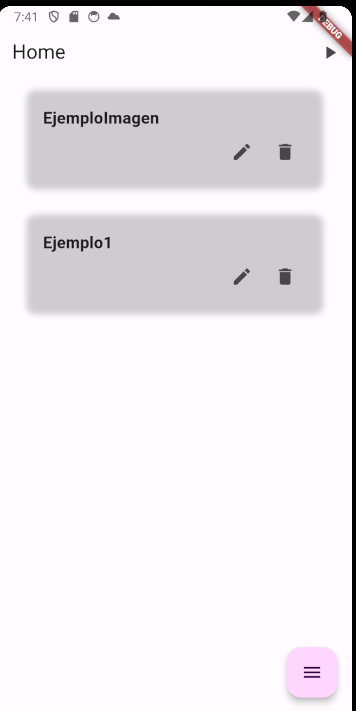
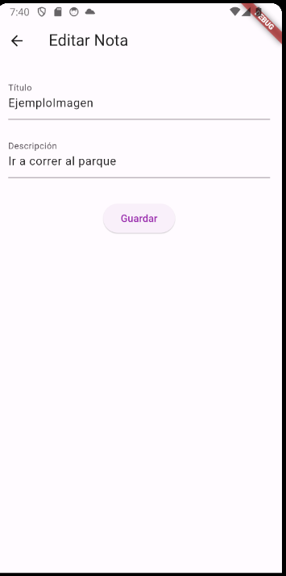
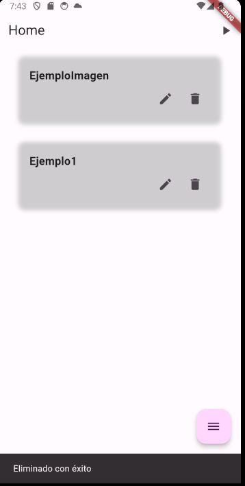
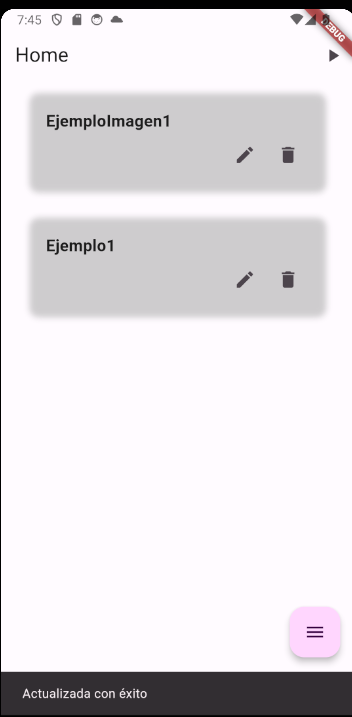

# Notes App

- Queries a Firebase:
- deleteNote
- updateExistingNote
- findByName
- sortByDate

## Lo que más me costo trabajo

- **1**

  -

- **2**

  -

- **3**

  -

## Lo que aprendí

- **1**

  -

- **2**

  -

- **3**

  -

## Screenshots

<!-- 

 -->
